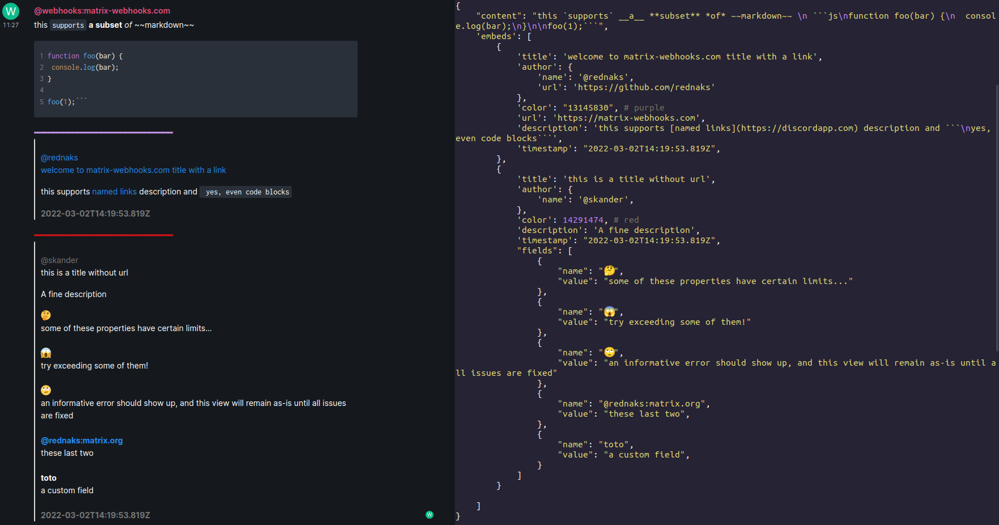

# Matrix-Webhooks
Rich and Embedded webhooks messages for your Matrix rooms.

## Features
### Embedded Messages
Discord compatible webhooks makes it easy to migrate from Discord to Matrix. It enables you to send well structured and rich messages that you can customize.

### Easy Integration
Support webhooks from github, gitlab, grafana, Uptime Kuma ...

### Demo: you can use or try matrix-webhooks here : [Demo](https://matrix-webhooks.com/)

## Screenshot

